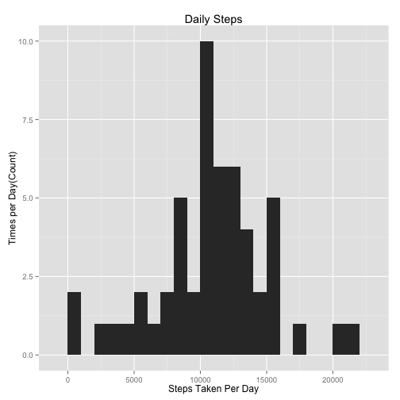
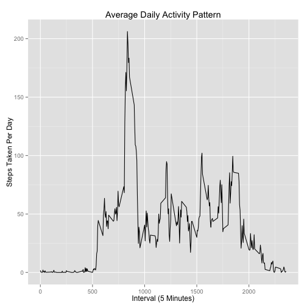
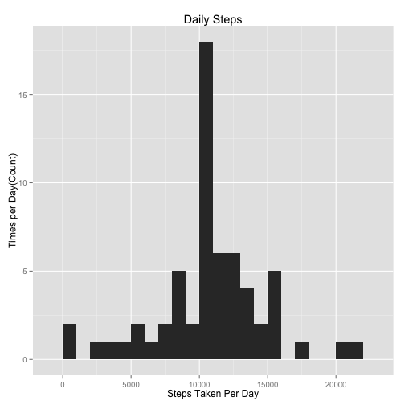

Loading and Processing the Data
===============================


```r
echo = TRUE 
activity <- read.csv("activity.csv", header = TRUE)
date <- as.Date(activity$date, format = "%Y-%m-%d", na.rm=TRUE)
interval <- as.integer(activity$interval, na.rm=TRUE)
steps <- as.integer(activity$steps, na.rm=TRUE)
```

What is the Mean Total Number of Step Taken Per Day?
=====================================================


```r
library(ggplot2)
steps_per_day <- aggregate(steps~date, activity, sum)
ggplot(steps_per_day, aes(steps)) + geom_histogram(binwidth=1000) + labs(title= "Daily Steps", x = "Steps Taken Per Day", y= "Times per Day(Count)")
```

 

```r
mean_steps_per_day <- mean(steps_per_day$steps, na.rm=TRUE)
median_steps_per_day <- median(steps_per_day$steps, na.rm=TRUE)
mean_steps_per_day
```

```
## [1] 10766.19
```

```r
median_steps_per_day
```

```
## [1] 10765
```

The mean number of steps per day is 10766.19. 
The median number of steps per day is 10765.


What is the average daily activity pattern?
============================================


```r
average_steps <- aggregate(steps~interval, activity, mean, na.rm=TRUE)
ggplot(average_steps, aes(interval, steps)) + geom_line() + labs(title="Average Daily Activity Pattern", x = "Interval (5 Minutes)", y = "Steps Taken Per Day")
```

 

```r
average_steps[which.max(average_steps$steps),]
```

```
##     interval    steps
## 104      835 206.1698
```

On interval 835, the highest avergae is 206.17


Imputing Missing Values
=======================


```r
total_na <- sum(is.na(steps))
total_na
```

```
## [1] 2304
```

The total number of missing values is 2304


```r
mean_substitue <- function(steps, interval) {
    substitution <- NA
    if (!is.na(steps))
        substitution <- c(steps)
    else
        substitution <- (average_steps[average_steps$interval==interval, "steps"])
    return(substitution)
}
activity2 <- activity
activity2$steps <- mapply(mean_substitue, steps, interval)

library(ggplot2)
steps_per_day <- aggregate(steps~date, activity2, sum)
ggplot(steps_per_day, aes(steps)) + geom_histogram(binwidth=1000) + labs(title= "Daily Steps", x = "Steps Taken Per Day", y= "Times per Day(Count)")
```

 

```r
mean_steps_per_day <- mean(steps_per_day$steps, na.rm=TRUE)
median_steps_per_day <- median(steps_per_day$steps, na.rm=TRUE)
mean_steps_per_day
```

```
## [1] 10766.19
```

```r
median_steps_per_day
```

```
## [1] 10766.19
```

The new mean steps per day is 10766.19.  The new median steps per day is 10766.19.  Changing the missing values to the mean of the steps per day causes the median to change slightly. It has no effect on the mean.

Are there differences in activity patterns between weekdays and weekends?
=========================================================================


```r
weekday_or_weekend <- function(date) {
    day <- weekdays(date)
    if (day %in% c("Monday", "Tuesday", "Wednesday", "Thursday", "Friday"))
        return("weekday")
    else if (day %in% c("Saturday", "Sunday"))
        return("weekend")
    else
        stop("invalid date")
}
activity2$date <- as.Date(activity2$date)
activity2$day <- sapply(activity2$date, weekday_or_weekend)


average_steps <- aggregate(steps~interval+ day, activity2, mean, na.rm=TRUE)
ggplot(average_steps, aes(interval, steps)) + geom_line() + facet_grid(day~.) + labs(title="Average Daily Activity Pattern", x = "Interval (5 Minutes)", y = "Steps Taken Per Day")
```

 

We can see from the graphs that there are higher activity peaks during the week but there are more activity peaks on the weekend. There could be several factors that contribute to this difference. We could figure out these factors using some further investigation.
